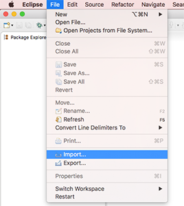
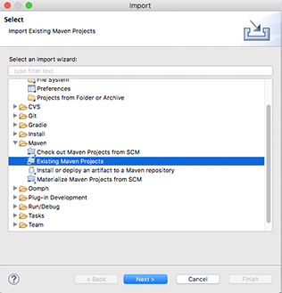
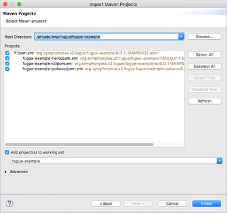

# Import The Example Projects into Eclipse
From the Eclipse menu select **File/Import...**

Then select **Maven/Existing Maven Projects**

Navigate to the directory where you cloned the git repo and click **Finish**

Open the **fugue-example-hello**project and navigate to the class **HellowWorld**. Right click on that file and select **Run As.../Java Application**.

You will now see the log output from the service in the Colsole View and your browser should open on **http://127.0.0.1:8080** to display the Hello World page, as before.

# Next Steps
The next step is to TBD

