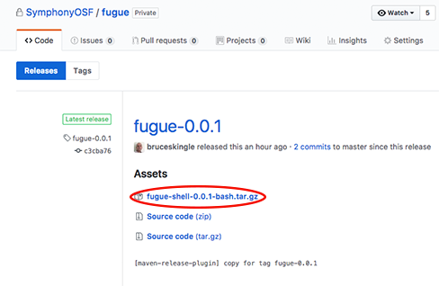

# Install the Fugue CLI
To install the Fugue CLI visit the [Fugue Releases Page](https://github.com/SymphonyOSF/fugue/releases) and download the latest CLI release.

The release page should look something like this:



Look for the fugue-shell binary download and click to download it.

On OSX you can double click on the tarball to extract it. The contents are all contained within a directory called fugue. Move the extracted directory to a convenient place, such as your home directory, and edit your profile file to add this directory to your execution path by adding a line like this:

```
export PATH=$PATH:~/fugue
```

The fugue CLI maintains a set of parameter defaults in a file at **${FUGUE_HOME}/config.properties** and if **${FUGUE_HOME}** is undefined this defaults to **~/.fugue**.

We can start by setting the default configuration. The current default value is shown in square brackets, press return to keep this default or enter another value. Remember to substitute your Google project ID for **sym-dev-arch**:

```
$ fugue config set
Enter FUGUE_CLOUD [google]:
Enter FUGUE_PROJECT [myproject]:sym-dev-arch
Enter FUGUE_IMAGE []:fugue-example-hello
Enter FUGUE_IMAGE_VERSION []:0.0.1-SNAPSHOT
Enter FUGUE_ENV []:dev
Configuration updated.
$
```

# Next Steps
The next step is to [Try The Example Applications](tryTheExamples.md)


