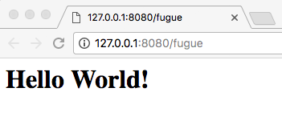

# Try The Example Applications
The next step is to clone the example applications and try them out:

```
$ mkdir /tmp/fugue
$ cd /tmp/fugue
$ git clone https://github.com/SymphonyOSF/fugue-example.git
Cloning into 'fugue-example'...
remote: Counting objects: 73, done.
remote: Compressing objects: 100% (43/43), done.
remote: Total 73 (delta 10), reused 61 (delta 4), pack-reused 0
Unpacking objects: 100% (73/73), done.
$ cd fugue-example/
$ mvn clean package
[INFO] Scanning for projects...
[INFO] ------------------------------------------------------------------------
[INFO] Reactor Build Order:
[INFO] 
[INFO] fugue
[INFO] fugue-example-hello
[INFO] fugue-example-di
[INFO] fugue-example-pubsub
[INFO] 
[INFO] ------------------------------------------------------------------------
[INFO] Building fugue 0.0.1-SNAPSHOT
[INFO] ------------------------------------------------------------------------
```

Many lines of maven output removed for clarity

```
[INFO] ------------------------------------------------------------------------
[INFO] Reactor Summary:
[INFO] 
[INFO] fugue .............................................. SUCCESS [  0.970 s]
[INFO] fugue-example-hello ................................ SUCCESS [  3.419 s]
[INFO] fugue-example-di ................................... SUCCESS [  0.267 s]
[INFO] fugue-example-pubsub ............................... SUCCESS [  3.030 s]
[INFO] ------------------------------------------------------------------------
[INFO] BUILD SUCCESS
[INFO] ------------------------------------------------------------------------
[INFO] Total time: 7.885 s
[INFO] Finished at: 2018-02-01T13:20:14-08:00
[INFO] Final Memory: 35M/741M
[INFO] ------------------------------------------------------------------------
$ 

```

The deployable unit for Fugue services is the Docker image, the build process generates one image per service, per cloud provider. The **docker images** command lists all images in the local Docker registry:

```
$ docker images
REPOSITORY                                                  TAG                 IMAGE ID            CREATED                  SIZE
fugue-example-pubsub                                        0.0.1-SNAPSHOT      d8cd13ff0b78        Less than a second ago   760MB
fugue-example-hello                                         0.0.1-SNAPSHOT      7d681d770e58        Less than a second ago   741MB
$
```

## fugue-example-hello
This is a simple "Hello World" application which implements an HTTP endpoint which simply says "Hello World!".

### Local Docker Deployment
This application can be deployed to your local Docker container directly from the command line with maven:

```
$ mvn -pl fugue-example-hello docker:start
[INFO] Scanning for projects...
[INFO] 
[INFO] ------------------------------------------------------------------------
[INFO] Building fugue-example-hello 0.0.1-SNAPSHOT
[INFO] ------------------------------------------------------------------------
[INFO] 
[INFO] --- docker-maven-plugin:0.23.0:start (default-cli) @ fugue-example-hello ---
[INFO] DOCKER> [fugue-example-hello:0.0.1-SNAPSHOT] "fugue-example-hello": Start container ae8404f3b1f2
[INFO] ------------------------------------------------------------------------
[INFO] BUILD SUCCESS
[INFO] ------------------------------------------------------------------------
[INFO] Total time: 2.084 s
[INFO] Finished at: 2018-02-01T13:38:17-08:00
[INFO] Final Memory: 16M/364M
[INFO] ------------------------------------------------------------------------
$ 
```

If you now point your browser at **http://127.0.0.1:8080** you should see this:



You can see the running container with the **docker ps** command:

```
$ docker ps
CONTAINER ID        IMAGE                                COMMAND                  CREATED                  STATUS              PORTS
ae8404f3b1f2        fugue-example-hello:0.0.1-SNAPSHOT   "/bin/sh -c 'java -c…"   Less than a second ago   Up 3 minutes        0.0.0.0:8080->8080/tcp
$ 
```

The container can be stopped using the maven **docker:stop** directive:

```
$ mvn -pl fugue-example-hello docker:stop
[INFO] Scanning for projects...
[INFO] 
[INFO] ------------------------------------------------------------------------
[INFO] Building fugue-example-hello 0.0.1-SNAPSHOT
[INFO] ------------------------------------------------------------------------
[INFO] 
[INFO] --- docker-maven-plugin:0.23.0:stop (default-cli) @ fugue-example-hello ---
[INFO] DOCKER> [fugue-example-hello:0.0.1-SNAPSHOT] "fugue-example-hello": Stop and removed container ae8404f3b1f2 after 0 ms
[INFO] ------------------------------------------------------------------------
[INFO] BUILD SUCCESS
[INFO] ------------------------------------------------------------------------
[INFO] Total time: 11.990 s
[INFO] Finished at: 2018-02-01T13:43:57-08:00
[INFO] Final Memory: 18M/488M
[INFO] ------------------------------------------------------------------------
$ 
```

### Kubernetes Deployment on Google
Deployment of the service to Google Kubernetes can be achieved with the **fugue deploy** command. The defaults for each parameter are provided from your fugue config, you can use the **fugue config set** command to set the default values, or you can override the default value each time you execute any fugue command.

**FUGUE_CLOUD** is the name of the cloud service provider to be used, currently only *google* is supported.

**FUGUE_PROJECT** is the name of the cloud service provider project you are using. You need to be separately authenticated to the project to be able to use these commands. The example did this earlier with the **gcloud auth login** command.

**FUGUE_IMAGE** is the name of the Docker image which is to be manipulated.

**FUGUE_IMAGE_VERSION** is the version ID of the image which is required. This is the Maven artefact version, and as we are deploying an example application which was built from source this will be a *-SNAPSHOT* version such as *0.0.1-SNAPSHOT*.

**FUGUE_ENV** is the name of a deployment configuration. This usually aligns with the logical environment (dev, test, prod) into which the deployment is being made.

```
$ fugue deploy
deploy
Enter FUGUE_CLOUD [google]:
Enter FUGUE_PROJECT [sym-dev-arch]:
Enter FUGUE_IMAGE [fugue-example-hello]:
Enter FUGUE_IMAGE_VERSION [0.0.1-SNAPSHOT]:
Enter FUGUE_ENV [dev]:
deploy google sym-dev-arch fugue-example-hello 0.0.1-SNAPSHOT deploy-dev.yaml
extracting fugue-example-hello:0.0.1-SNAPSHOT...
done
Application layer is 0b53c206599f29475bb945da59c9c2f3a45875d750040cd9623c6e86cff59309/layer.tar
The push refers to repository [gcr.io/sym-dev-arch/fugue-example-hello]
ebf913bedbbd: Pushed 
875b1eafb4d0: Layer already exists 
7ce1a454660d: Layer already exists 
d3b195003fcc: Layer already exists 
92bd1433d7c5: Layer already exists 
f0ed7f14cbd1: Layer already exists 
b31411566900: Layer already exists 
06f4de5fefea: Layer already exists 
851f3e348c69: Layer already exists 
e27a10675c56: Layer already exists 
0.0.1-SNAPSHOT: digest: sha256:b798100fb7a75b6328cc21e0ff5ba0501328b46b989edab4cdb87f77a27a235e size: 2422

SNAPSHOT deployment, deleting current deployment to force restart
Error from server (NotFound): deployments.extensions "fugue-example-hello" not found
No current deployment
deployment "fugue-example-hello" created
service "fugue-example-hello" created
Deleted temp working directory /var/folders/4k/0sfqq6v1605547b2gjcldk2h0000gn/T/tmp.q4WOPznM
$ 
```

The previously built Docker image is retrieved from the Docker registry, a Kubernetes deployment descriptor is extracted from the image, based on the value of **FUGUE_ENV**.

The required image is pushed to the Google Docker registry, which is required so that the Google Kubernetes engine can deploy the image.

Because we are deploying a SNAPSHOT image, fugue deletes the existing deployment before configuring the new one to ensure that all existing instances of the service are restarted with the new image. In production and production like environments this would be undesirable because it would cause an interruption of service. When deploying a non-SNAPSHOT version this deletion is not needed and not done, the standard Kubernetes restart mechanism will then perform a rolling restart to avoid a service interruption.

We can now use kubectl to see the runnning pod (Docker image instance) and service (load balancer):

```
$ kubectl get pod
NAME                                  READY     STATUS    RESTARTS   AGE
fugue-example-hello-394849897-0m85w   1/1       Running   0          32m
$ kubectl get service
NAME                  TYPE           CLUSTER-IP     EXTERNAL-IP     PORT(S)        AGE
fugue-example-hello   LoadBalancer   10.31.249.97   35.184.157.65   80:31388/TCP   33m
kubernetes            ClusterIP      10.31.240.1    <none>          443/TCP        8d
$ 
```

The EXTERNAL-IP on the LoadBalancer entry is the IP Address on which the service is exposed, so we can now point a browser at http://35.184.157.65 and see the same Hello World! page as before.

Note that we do not need to add a port number to the URL because the load balancer is configured to map port 80 on the public IP address to port 8080 on each instance image (as shown by **80:31388/TCP** in the PORTS column in the display above).

To see the log output from the container use kubectl logs, the -f flag has the same meaning as with **tail** (the **kubectl get pod** command above provides the ID of the individual pod):

```
$ kubectl logs -f fugue-example-hello-394849897-0m85w 
00:32:27.544 [main] DEBUG o.s.s.f.d.c.impl.Slf4jLogComponent - Binding dependency IServletProvider from HelloWorldServer for HelloWorldServer
00:32:27.554 [main] DEBUG o.s.s.f.d.c.impl.Slf4jLogComponent - Start Slf4jLogComponent
00:32:27.554 [main] DEBUG o.s.s.f.d.c.impl.Slf4jLogComponent - Start HelloWorldServer
00:32:27.555 [main] INFO  o.s.s2.fugue.core.FugueServer - FugueServer Started
00:32:27.601 [main] INFO  org.eclipse.jetty.util.log - Logging initialized @811ms to org.eclipse.jetty.util.log.Slf4jLog
00:32:27.748 [main] INFO  o.s.s2.common.http.HttpServer - Starting S2HttpServer...
00:32:27.750 [main] INFO  org.eclipse.jetty.server.Server - jetty-9.4.8.v20171121, build timestamp: 2017-11-21T21:27:37Z, git hash: 82b8fb23f757335bb3329d540ce37a2a2615f0a8
00:32:27.789 [main] INFO  o.e.j.server.handler.ContextHandler - Started o.e.j.s.ServletContextHandler@17579e0f{/,null,AVAILABLE}
00:32:27.812 [main] INFO  o.e.jetty.server.AbstractConnector - Started ServerConnector@60f5f763{HTTP/1.1,[http/1.1]}{0.0.0.0:8080}
00:32:27.812 [main] INFO  org.eclipse.jetty.server.Server - Started @1028ms
00:32:27.813 [main] INFO  o.s.s2.fugue.core.FugueServer - server started on http://127.0.0.1:8080
00:32:27.813 [main] INFO  o.s.s2.fugue.core.FugueServer - you can also point your browser to http://fugue-example-hello-394849897-0m85w:8080
00:32:27.813 [main] INFO  o.s.s2.fugue.core.FugueServer - you can also point your browser to http://10.28.1.38:8080
```

Finally, to get a shell on the running container use this:

```
$ kubectl exec -it fugue-example-hello-394849897-0m85w -- /bin/bash
root@fugue-example-hello-394849897-0m85w:/# ls -l maven
total 4152
-rw-r--r-- 1 root root   58231 Feb  1 19:18 S2-common-core-0.1.11.jar
-rw-r--r-- 1 root root   13618 Feb  1 19:21 S2-common-http-0.1.11.jar
-rw-r--r-- 1 root root  284184 Sep 21 23:09 commons-codec-1.10.jar
-rw-r--r-- 1 root root   13055 Feb  1 19:28 fugue-core-0.0.1.jar
-rw-r--r-- 1 root root   26369 Feb  1 19:28 fugue-di-0.0.1.jar
-rw-r--r-- 1 root root   11985 Feb  2 00:28 fugue-example-hello-0.0.1-SNAPSHOT.jar
-rw-r--r-- 1 root root   95806 Sep 21 23:54 javax.servlet-api-3.1.0.jar
-rw-r--r-- 1 root root  164892 Dec 14 01:18 jetty-http-9.4.8.v20171121.jar
-rw-r--r-- 1 root root  128560 Dec 14 01:18 jetty-io-9.4.8.v20171121.jar
-rw-r--r-- 1 root root   93173 Dec 14 01:18 jetty-security-9.4.8.v20171121.jar
-rw-r--r-- 1 root root  585344 Dec 14 01:18 jetty-server-9.4.8.v20171121.jar
-rw-r--r-- 1 root root  110246 Dec 14 01:18 jetty-servlet-9.4.8.v20171121.jar
-rw-r--r-- 1 root root  481910 Dec 14 01:18 jetty-util-9.4.8.v20171121.jar
-rw-r--r-- 1 root root   19936 Sep 21 23:08 jsr305-3.0.2.jar
drwxr-xr-x 2 root root    4096 Feb  2 00:28 kubernetes
-rw-r--r-- 1 root root  264600 Oct 29 16:56 logback-classic-1.0.13.jar
-rw-r--r-- 1 root root  418870 Oct 29 16:56 logback-core-1.0.13.jar
-rw-r--r-- 1 root root 1411071 Jan 29 18:03 protobuf-java-3.5.1.jar
-rw-r--r-- 1 root root   32127 Sep 21 23:55 slf4j-api-1.7.12.jar
root@fugue-example-hello-394849897-0m85w:/# 
```


# Next Steps
The next step is to [Import The Examples to Eclipse](ide/eclipse/import.md)


